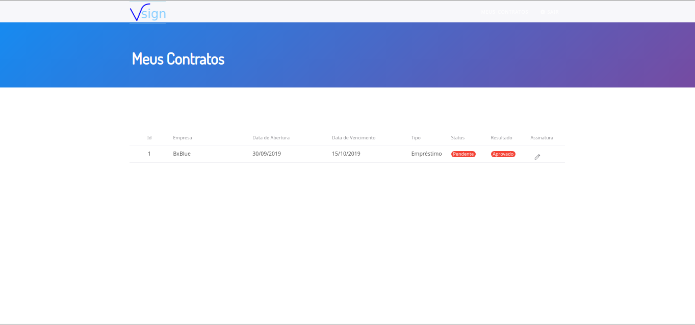
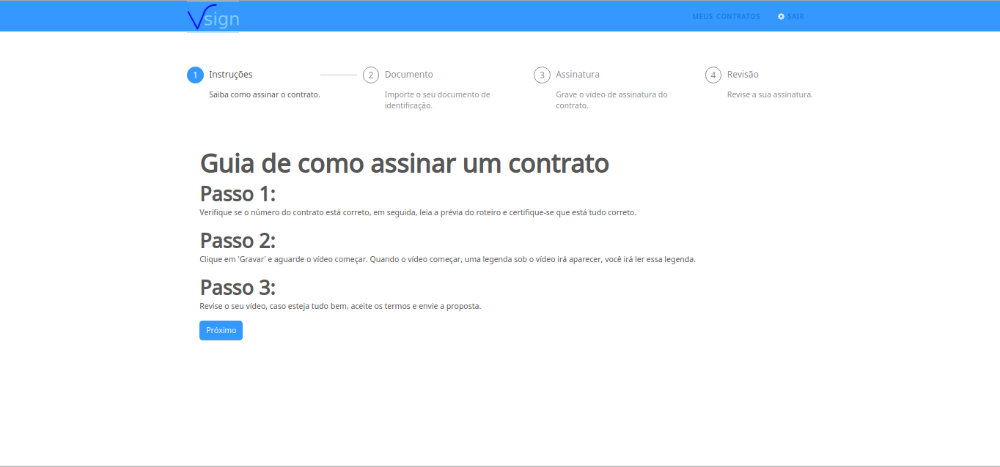
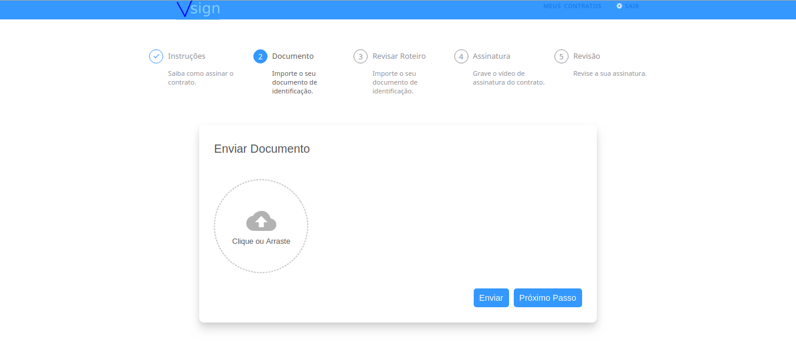
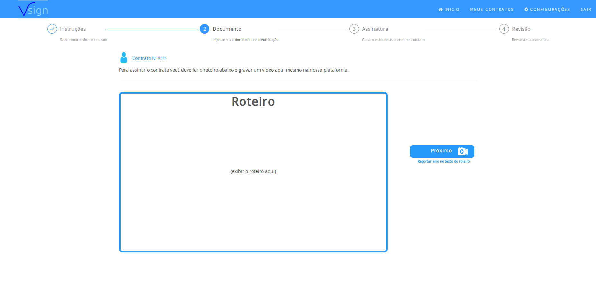
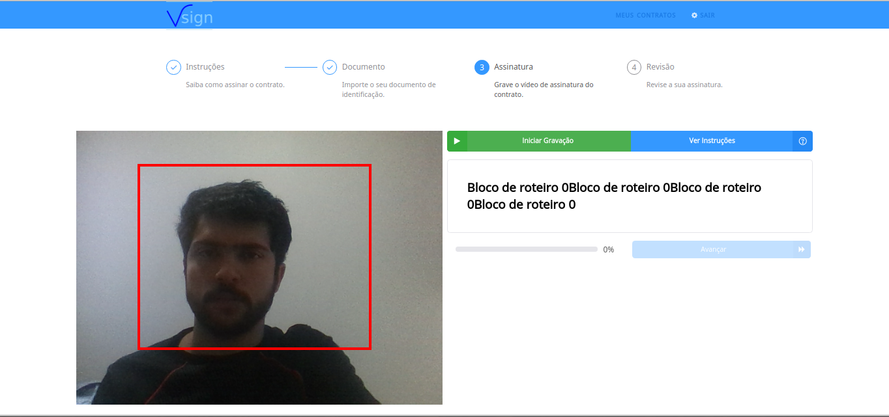
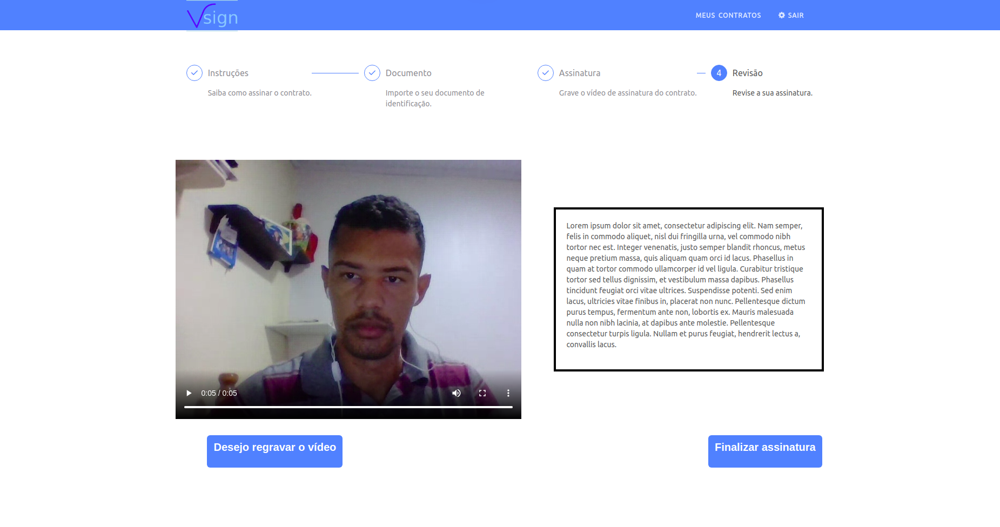

[](https://circleci.com/gh/fga-eps-mds/2019.2-Vsign)
[](https://codeclimate.com/github/fga-eps-mds/2019.2-Vsign/maintainability)
[](https://codeclimate.com/github/fga-eps-mds/2019.2-Vsign/test_coverage)
[](https://www.gnu.org/licenses/gpl-3.0)

<div style="text-align:center"></div>

<h1 align="center"> Conheça esta inovação ainda mais segura para você!</h1>

### Sobre o projeto

<p align="justify"> &emsp;&emsp;
  O Vsign realiza assinatura através de gravação de vídeo com análise automática e notificação dos resultados em tempo real; um contratante submete um vídeo confirmando que aceitou os termos do contrato, proporcionando uma forma de assinatura fácil, rápida e segura, oferecendo comodidade e maior flexibilidade em contraste com as soluções de contratos atuais
</p>

### Overview de nossa aplicação

##### Landing Page

<div></div>

##### Login

<div></div>

##### Meus contratos

<div></div>

##### Guia de assinatura

<div></div>

##### Upload do documento

<div></div>

##### Roteiro

<div></div>

##### Gravação

<div></div>

##### Revisão

<div></div>

### Guia de Contribuição

Caso deseje contribuir com o projeto considere nosso <a href="https://github.com/fga-eps-mds/2019.2-Vsign/blob/master/CONTRIBUTING.md" margin=50> CONTRIBUTING</a> e <a href="https://github.com/fga-eps-mds/2019.2-Vsign/blob/master/CODE_OF_CONDUCT.md" margin=50> CODE OF CONDUCT</a>

## Guia para rodar o projeto com o Docker

- ### Instalação

Para o uso é necessário possuir o Docker e o Docker Compose em sua máquina.

[Instalação Docker](https://docs.docker.com/engine/installation/linux/docker-ce/)

[Instalação Docker-compose](https://docs.docker.com/compose/install/).

- ## Rodando a aplicação

Entre na pasta raíz do projeto em que está localizado o **docker-compose.yml** e digite no terminal:

&emsp;&emsp; Primeiro (Enquanto não houver alterações no Gemfile, package.json ou Dockerfile, não precisará repetir o comando):

```
  docker-compose build
```

&emsp;&emsp; Em seguida use o comando para subir o ambiente com logs.

```
  docker-compose up
```

&emsp;&emsp; Após ter subido o ambiente em um terminal, caso seja a primeira vez que esteja rodando a aplicação, crie o banco (em outro terminal e com o ambiente ainda rodando no anterior):

```
  docker-compose run backend rake db:create
```

&emsp;&emsp; Espere até que todos os serviços estejam disponíveis, acesse os servidores com os seguintes endereço:

- #### Rails : https://localhost:3000
- #### React : https://localhost:3001

Para subir um ambiente apenas, navegue até a pasta correspondente /backend ou /frontend onde se encontra o **docker-compose.yml**

```
  docker-compose up
```

- ## Comandos Principais

&emsp;&emsp; Para subir o ambiente com logs digite: (Criará a imagem baseado no Dockerfile e criará os containers de serviços que definimos no docker-compose.yml)

```
 docker-compose up
```

&emsp;&emsp; Para desligar o ambiente de maneira completa. (Para e remove os containers, networks, volumes e imagens criadas pelo "up")

```
 docker-compose down
```

&emsp;&emsp; Para executar comandos depois de ter subido o docker-compose. (Dentro do seu novo ambiente)

&emsp;&emsp;&emsp; Maneira direta. Exemplo: (Dirá a versão do Rails ou Node)

```
 docker-compose run backend rails -version

 docker-compose run frontend node --version
```

&emsp;&emsp;&emsp; Para abrir um prompt interativo para usar quantos comandos desejar: (Para sair digite: exit)

```
 docker-compose run backend sh

 docker-compose run frontend sh
```
