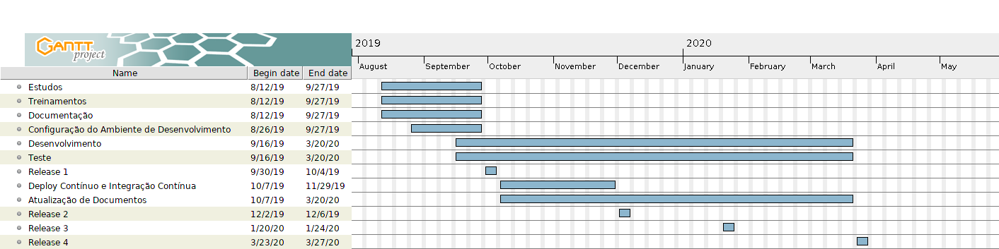

## Histórico de Versão

| <center>Versão</center> | <center>Descrição</center> | <center>Autor</center> |
| :----: | :-------: | :---: |
| 0.1 | Abertura do documento | [Cauê](https://github.com/caue96) |
| 0.2 | Montagem da estrutura do documento | [Cauê](https://github.com/caue96) |
| 0.3 | Tópicos 1 a 3, 4.1 e 5 | [Cauê](https://github.com/caue96) |
| 0.4 | Tópicos 4.2 a 4.5 | [Cauê](https://github.com/caue96) |

---

# 1. Resumo Executivo
- Definição do projeto (visão, objetivos, escopo e entregáveis);
- Organização do projeto (usuários, stakeholders, papéis, responsabilidades);
- Planejamento do projeto (abordagem, cronograma, planejamento de recursos, financeiro e de qualidade);
- Considerações do projeto (riscos, suposições e restrições);
- Referências.


# 2. Definição do Projeto

## 2.1 Visão
Desenvolver um sistema que apresente e colete informações dos usuários por meio de informações cadastrais e as transporte para a nuvem. Informações armazenadas serão confrontadas com vídeo e áudio produzido pelo usuário para se fazer a assinatura do contrato de empréstimo consignado após a extração e análise dos dados;

## 2.2 Objetivos
**Objetivos de negócio:**
- Sistema funcional/desenvolvido por completo;
- Facilitar processo de assinatura de contrato para crédito consignado;
- Receber confirmação de validação da assinatura do contrato em segundos.

**Objetivos de tecnologia:**
- Desenvolver um sistema de validação de assinatura de contrato por vídeo e áudio com 100% de confiabilidade;
- Extração, análise e validação das informações de vídeo e áudio em segundos;

## 2.3 Escopo
- Automatização e facilitação (por parte do usuário e da bxblue) no processo de assinatura do contrato;
- Desenvolvimento de sistema web para cadastro de informações do usuário e gravação de vídeo e áudio para contratação de empréstimo consignado;
- Utilização de tecnologias de armazenamento das informações em nuvem, análise de vídeo e análise de voz.

## 2.4 Entregáveis
| <center>Item</center> | <center>Componentes</center> | <center>Descrição</center> |
| :--: | :--------- | :-------- |
| Documentação | 1. Protótipo<br> 2. Documento de Visão<br> 3. Documento de Arquitetura<br> 4. Earned Value Management | 1. Simulação do produto final<br> 2. Visão ampla do software<br> 3. Arquitetura que foi desenvolvido o software<br> 4. Medir desempenho e progresso do projeto |
| Código | 1. Primeira versão<br> 2. Segunda versão | 1. Entrega das funcionalidades funcionando<br> 2. Entrega do software com as funcionalidades aprimoradas |


# 3. Organização do Projeto

## 3.1 Usuários
| <center>Usuário</center> |
| :-----: |
| Aposentados e pensionistas do INSS |
| Servidores públicos federais, estaduais e municipais |
| Trabalhadores com carteira assinada |
| Militares das Forças Armadas |

## 3.2 Stakeholders
| <center>Stakeholders</center> | <center>Interessado em</center> |
| :----------: | :------------- |
| Fenasbac | Soluções inovadores que serão desenvolvidas |
| Banco Central do Brasil | Revisar questões estruturais do próprio BC a partir do projeto desenvolvido |
| bxblue | Aproveitando da solução desenvolvida para integração no software próprio deles |
| Sociedade brasileira | Facilitação em contratação de crédito consignado |

## 3.3 Papéis
| Nome | Papel |
| :--: | :---: |
|[Cauê Mateus](https://github.com/caue96)| Product Owner |
|[Kairon Veloso](https://github.com/kairon-v)| Arquiteto |
|[Marcos Cabeceira](https://github.com/Foxtrot40)| Desenvolvedor |
|[Marcos Floresta](https://github.com/MarcosFloresta)| Desenvolvedor |
|[Marcos Gabriel](https://github.com/marcosgtavares)| Desenvolvedor |
|[Thiago Pereira](https://github.com/thiagorpereira)| DevOps |
|[Victor Gomide](https://github.com/victoralvesgomide)| Scrum Master |
|[Vinicius Porto](https://github.com/ViniciusPuerto)| Desenvolvedor |
|[William Viera](https://github.com/williamtpv)| Desenvolvedor |

## 3.4 Responsabilidades
**Arquiteto:**
- Levantamento de roadmap de requisitos;
- Proposta de arquitetura micro serviços;
- Orquestração de containeres com micro serviços.

**Desenvolvedor:**
- Código/Entrega;
- Documentação;
- Coerência - documentos e código|;
- Histórias e planejamento da release;
- Testes automatizados e cobertura de código;
- Tracking;
- Wiki Atualizada;
- Software implantado e disponível para uso.

**DevOps:**
- Ambiente de desenvolvimento via container;
- Gitflow;
- Pipeline de integração e deploy contínuos;
- Integração contínua;
- Ambiente de homologação/produção;
- Roadmap de deploy contínuo;
- Evidência de deploy contínuo.

**Product Owner:**
- Visão de produto;
- Retorno de Investimento (ROI);
- Plano de negócio - Canvas;
- Priorização das issues - visão de produto;
- Guia de usabilidade/protótipos de identidade visual - identidade visual;
- Roadmap de produto - MVP + Pitch de venda.

**Scrum Master:**
- Comunicação;
- Indicadores e métricas de produtividade;
- Metas de entrega contínua;
- Monitoramento e controle Ágil;
- Roadmap para alcancar a produtividade máxima do time;


# 4. Planejamento do projeto

## 4.1 Abordagem
| Fase | Abordagem |
| :--: | :-------- |
| Iniciação | Autorização para início do projeto |
| Ideação | Definições do projeto, design e prototipação |
| Criação | Planejamento, desenvolvimento, teste e revisão. Processo se repete em loop |
| Evolução | Transferência de conhecimento e melhoria contínua. Vem logo após a etapa de criação e também se repete em loop |

## 4.2 Cronograma
[](https://ibb.co/fxrGWWq)

## 4.3 Planejamento de Recursos
**Release 1**

| Papel | Data de início | Data final | Esforço |
| :---: | :------------: | :--------: | :-----: |
| Arquiteto | 12/08/2019 | 29/09/2019 | 100% |
| Desenvolvedor | 12/08/2019 | 29/09/2019 | 80% |
| DevOps | 12/08/2019 | 29/09/2019 | 100% |
| Product Owner | 12/08/2019 | 29/09/2019 | 100% |
| Scrum Master | 12/08/2019 | 29/09/2019 | 100% |

**Release 2**

| Papel | Data de início | Data final | Esforço |
| :---: | :------------: | :--------: | :-----: |
| Arquiteto | 30/09/2019 | 01/12/2019 | 80% |
| Desenvolvedor | 30/09/2019 | 01/12/2019 | 100% |
| DevOps | 30/09/2019 | 01/12/2019 | 100% |
| Product Owner | 30/09/2019 | 01/12/2019 | 80% |
| Scrum Master | 30/09/2019 | 01/12/2019 | 100% |

**Release 3**

| Papel | Data de início | Data final | Esforço |
| :---: | :------------: | :--------: | :-----: |
| Arquiteto | 02/12/2019 | 26/01/2020 | 60% |
| Desenvolvedor | 02/12/2019 | 26/01/2020 | 100% |
| DevOps | 02/12/2019 | 26/01/2020 | 80% |
| Product Owner |02/12/2019  | 26/01/2020 | 60% |
| Scrum Master | 02/12/2019 | 26/01/2020 | 100% |

**Release 4**

| Papel | Data de início | Data final | Esforço |
| :---: | :------------: | :--------: | :-----: |
| Arquiteto | 27/01/2020 | 29/03/2020 | 40% |
| Desenvolvedor | 27/01/2020 | 29/03/2020 | 100% |
| DevOps | 27/01/2020 | 29/03/2020 | 80% |
| Product Owner | 27/01/2020 | 29/03/2020 | 60% |
| Scrum Master | 27/01/2020 | 29/03/2020 | 100% |

Nas sprints 2, 3 e 4 os papéis que estiverem com menos esforço em suas funções usaram do tempo que estiverem livre para dar suporte ao time de desenvolvimento, trabalhando junto a eles.

## 4.4 Planejamento Financeiro
O custo do projeto será calculado levando em consideração 4 premissas:
- Tempo fixo de desenvolvimento de 8 meses. Os 2 primeiros meses com trabalho de 10 horas semanais por membro e os 6 meses subsequentes com trabalho de 20 horas semanais por membro;
- Trabalho sendo realizado 100% remoto;
- Escopo do software definido com base no tempo determinado de trabalho dos 2 pontos anteriores;
- Número de membros da equipe não irá aumentar e se diminuir o trabalho será redistribuido entre os outros membros assim como o valor ganho pelo membro que saiu.

Tomando como base essas 3 premissas podemos fazer o cálculo de quanto custará esse projeto.<br>
O custo do projeto será calculado com base no salário da mão de obra de desenvolvedores full stack apontado pelo site do stackoverflow. O site calcula os valores antes da taxação de impostos de ganhos anuais em média com desenvolvimento de software. Ele possui filtros de posição, localização, educação, anos de experiência e tecnologias. Para o cálculo de nosso custo levaremos em consideração os critérios apontados na tabela abaixo.

| Posição | Localização | Educação | Anos de experiência | tecnologias |
| :-----: | :---------: | :------: | :-----------------: | :----------------: |
| Full Stack | Brasília - Distrito Federal | Menos que bacharelado | 0 | <ul><li>css</li><li>html</li><li>javascript</li><li>ruby</li><li>reactjs</li></ul> |
| DevOps | Brasília - Distrito Federal | Menos que bacharelado | 2 | <ul><li>css</li><li>html</li><li>javascript</li><li>ruby</li><li>reactjs</li></ul> |

<dl>
    <dt>Explicação dos critérios:</dt>
        <dd>Posição: arquiteto, product owner e scrum master foram colocados como devops, pois o filtro de posições do stackoverflow não possui essas divisões e o restante da equipe que é de desenvolvimento foi colocada como full stack.</dd>
        <dd>Localização: como somos todos de Brasília o valor foi colocado como mão de obra de nossa localização.</dd>
        <dd>Educação: o que mais se aproxima de graduando nos filtros é o de menos que bacharelado.</dd>
        <dd>Anos de experiência: com 0 anos de experiência colocamos os membros da matéria de MDS e com 2 anos de experiência colocamos os membros da matéria de EPS.</dd>
        <dd>Tecnologias: colocamos as tecnologias que tinham no stackoverflow e terão em nosso projeto.</dd>
</dl>

Após pedido para calcular o salário a calculadora nos retorna salários em 3 bases: os que ganham menos do que 75% dos desenvolvedores, os que ganham na média e os que ganham mais do que 75% dos desenvolvedores. Levando em consideração o nível do estudo que temos na Universidade de Brasília, a UnB nos da base para ganhar no espaço dos que ganham mais do que 75% dos desenvolvedores e será nesse bloco que faremos os cálculos da mão de obra. No quadro abaixo podemos ver a quantidade de pessoas por posição, experiência e o valor hora que será cobrado.

| Quantidade | Posição | Valor/Hora |
| :--------: | :-----: | :--------: |
| 5 | Full stack | 31,77 |
| 4 | DevOps | 40,62 |

Considerando as premissas colocadas e o valor/hora definido por membro já podemos fazer o cálculo de quanto será o desenvolvimento do software no período determinado. A quantidade de horas total trabalhadas no projeto será de (sabendo que em um mês tem em média 4 semanas):

Quantidade total projeto/membro = (40 * 2) + (80 * 6) = 560 horas

```
Custo = Horas total projeto * valor/hora * Número membros

5 desenvolvedores full stack com 0 anos de experiência:
    Custo = 560 * 31,77 * 5 = R$ 88.956,00

4 devops (1 arquiteto, 1 product owner e 1 scrum master) com 2 anos de experiência:
    Custo = 560 * 40,62 * 4 = R$ 90.988,80

Custo Total = 88.956 + 90.988,8 = R$ 179.944,80
```

O projeto terá um custo de **R$ 179.944,80** mais custos adicionais por meio de apresentação de notas fiscais em casos de necessidade de deslocamentos e alimentações.

## 4.5 Planejamento de Qualidade
| Processo | Descrição |
| :------: | :-------- |
| Gerenciamento de integração | Bastante comunicação entre todos para que como um grupo saibamos o que está acontecendo em todas as pontas |
| Gerenciamento de escopo | Manter escopo similar ao que foi acordado no início do projeto |
| Gerencimento do cronograma | Cumprimento dos prazos com o que foi combinado no cronograma, manter eventos com a sequência precisa e atualizada |
| Gerenciamento de custo | Manter os custos do projeto dentro do que foi acordado no início do projeto, fazer uso dos recursos dentro do orçamento e do tempo de projeto |
| Gerenciamento da qualidade | Revisão de todo trabalho realizado, templates para issue e pull request, folha de estilo e boas práticas de desenvolvimento de software |
| Gerenciamento de recurso | Utilizar membros com eficiência, sabendo alocar duplas de pareamento de acordo com o conhecimento, experiência e habilidade de cada um |
| Gerenciamento de comunicação | Montar estrutura de comunicação eficiente, rápida e fazer o controle de informações de todos os membros |
| Gerenciamento de risco | Identificar, analisar e controlar riscos, elaborando um plano para que haja resposta rápidas quando surgir |
| Gerenciamento de projeto | Solução de problemas no momento que eles acontecerem, sempre motivando a equipe e tirando a pressão sobre os membros para que eles possam atingir a melhor produtividade possível |


# 5. Considerações do Projeto

## 5.1 Riscos
| Descrição | Probabilidade | Impacto | Ações de mitigação |
| :-------- | :-----------: | :-----: | :----------------- |
| Desistência de membro | Média | Alto | Acúmulo de função por membro que tiver com menos trabalho para fazer |
| Ausência constante de membro | Alta | Médio | Identificar o membro com problemas e entregar tarefas mais simples e menos importantes para ele |
| Atrasos por dificuldades com as tecnologias | Média | Baixo | Atraso inicial em entregas do software por dificuldades com as tecnologias utilizadas |
| Problemas com computadores de membro da equipe | Média | Baixo | Procurar outro computador para membro com problemas continuar o trabalho |
| Falta de comunicação | Alta | Médio | Motivar a equipe a se comunicar melhor, encorajar a comunicação, deixar claro a importância da comunicação e reforçar os meios de comunicação oficiais da equipe |

## 5.2 Suposições
- Escopo não irá mudar durante o desenvolvimento do software;
- Algum stakeholder da bxblue sempre estará disponível para nos atender;

## 5.3 Restrições
- A quantidade de pessoas participantes no projeto não será aumentada até final dos desafios do projeto;
- Restrição de custo com desenvolvimento;


# 6. Referências

1. [www.projectmanager.com](https://www.projectmanager.com/templates/project-charter-template?a=downloadGateUnlock&r=5d7ac3d9ae36e&e=Y2F1ZW1hdGV1c0Bob3RtYWlsLmNvbQ==)<br>
2. [Apresentação da bxblue no youtube](https://www.youtube.com/watch?v=yGntclHFnxg&feature=youtu.be)
3. [stackoverflow calculator salary](https://stackoverflow.com/jobs/salary)
